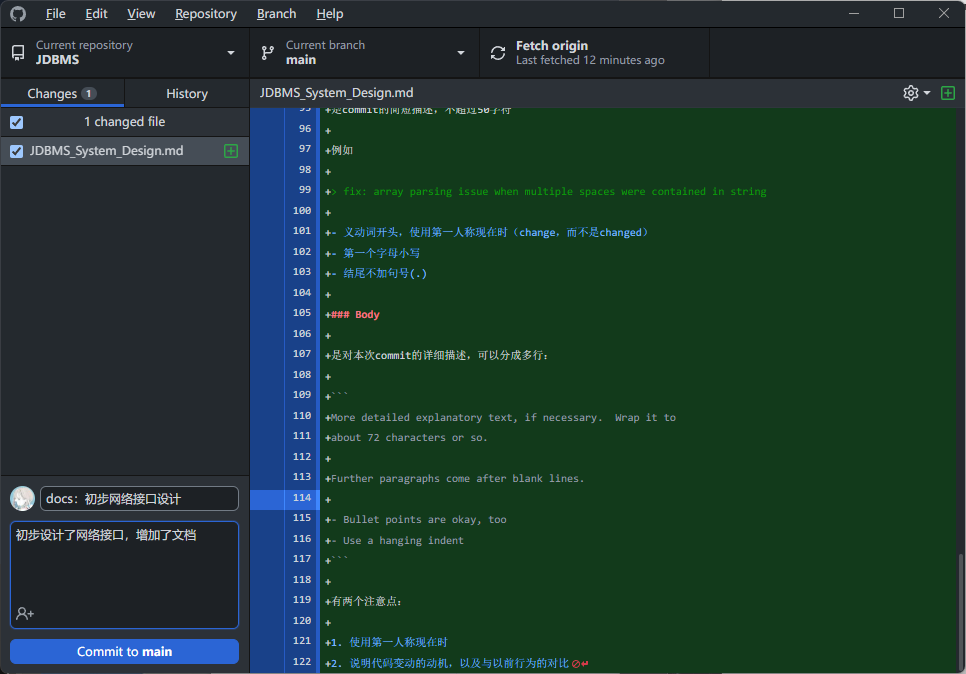
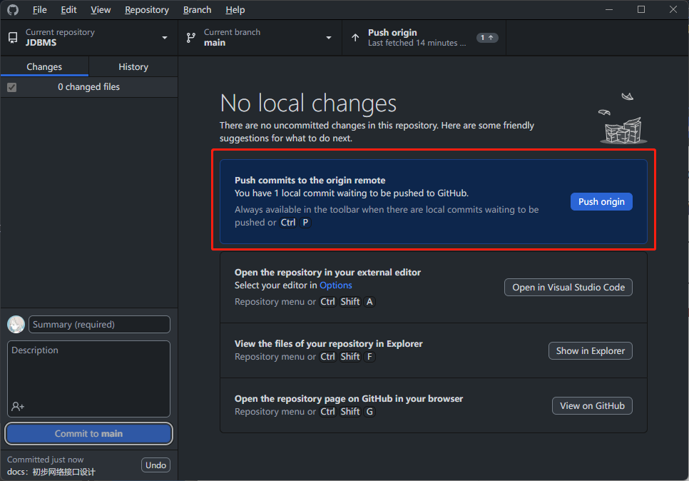

# DBMS系统

## 前端

## 后端

采用Java17编写，通过TCP网络连接和前端实现通信。

### 说明

后端由四大模块组成：存储系统、SQL解析和序列化执行系统、数据库结构系统、TCP连接系统。 分别如下：

### 数据库结构系统

是数据库主要信息的交互结构层。向底层的存储系统提供数据，并接受SQL序列化执行系统的访问并返回增删改查结果。主要的类包括：

#### Database类

#### Table类

存储系统

### TCP连接系统

TCP服务器系统的功能包括：

* 接受客户端连接并收发客户端的消息
* 根据客户端请求调用下层系统的相关接口
* 将接口返回的内容编码后发送给客户端

主要的类包括：

#### MultiClientTCPServer类

* 实现一个用来Accept客户端连接请求的线程池
* 实现将连接后产生的socket打包成ClientHandler类并发送给客户端线程池执行
* 维护一个客户端线程池并添加客户端连接

#### ClientHandler类

* 持有并维护客户端线程
* 持有客户端连接的用户信息
* 接受并解析客户端发送的消息
* 根据解析的消息调用系统相关接口
* 将接口返回的信息编码后发送给客户端

## 接口

### 说明

* 位于<>内部的是变量，是消息中的可变部分，其余是消息中的不可变部分
* 消息采用应答机制，所有客户端发出的消息必须等到收到服务端的应答后，才能发出下一条；若没有收到，则等待，直到超时
* 消息必须含有消息头（$）
* 消息必须含有消息尾（#）
* 保留字符：消息的可变部分中，不得出现以下保留字符（全部是英文字符）：
  * $
  * :
  * #

### 注册

| 客户端->服务端     | 服务端->客户端                                        |
| ------------------ | ----------------------------------------------------- |
| `$Reg:<Username>#` |                                                       |
|                    | `$USER:Yes#`（用户存在）或者`$USER:NO#`（用户不存在） |
| `$PW:<Password>#`  |                                                       |
|                    | `$PW:Success#`                                        |

### 登录

| 客户端->服务端           | 服务端->客户端                                               |
| ------------------------ | ------------------------------------------------------------ |
| ```$LOGIN:<Username>#``` |                                                              |
|                          | ```$USER:Yes#```（用户存在）或者```$USER:NO#```（用户不存在） |
| ```$PW:<Password>#```    |                                                              |
|                          | ```$PW:Success#``` 或 ```$PW:Fail#```                        |

### 执行SQL

| 客户端->服务端   | 服务端->客户端                                      |
| ---------------- | --------------------------------------------------- |
| `$SQL:<SQL>#` |                                                     |
|                  | `$SQL_FAIL:<Reason>#`（执行出错，返回报错信息）<br />或者<br />`$SQL_SUCC:<SQL Results>#`（SQL执行成功） |

### 登出

| 客户端->服务端 | 服务端->客户端                                               |
| -------------- | ------------------------------------------------------------ |
| `$EXIT#`       |                                                              |
|                | `$EXIT_FAIL:<Reason>#`（登出错误）<br /> 或者 <br />`$EXIT_SUCC#`（登出成功） |

### 权限管理

对数据库和表都可以设置以下四种权限：

* 读取（1）
* 插入（2）
* 修改（4）
* 删除（8）

权限可以用这些数字的加和来表示复合的状态，例如：

* 可以读取、插入、删除 = 权限值11
* 可以插入和修改 = 权限值6
* 可以读取和删除 = 权限值9
* 权限值最高 = 15

表和数据库采用以"."连接的字符串表示，可以用通配符“*”。具体来说，应当为“DATABASE.TABLE/\*”的形式

| 客户端->服务端                                | 服务端->客户端                                               |
| --------------------------------------------- | ------------------------------------------------------------ |
| `$PRIV:<Privillege Number>:<Database.Table>#` |                                                              |
|                                               | `$PRIV_FAIL:<Reason>#`（执行出错，返回报错信息） 或者 `$Priv_SUCC:<PRIV Results>#`（SQL执行成功） |

## Git的Commit日志规范

### Header

#### 格式

`<类别>: 主题`

#### 类别

1. feat：新功能（feature）
2. fix：修补bug
3. docs：文档（documentation）
4. style：格式（不影响代码运行的改动）
5. refactor：重构（即不是新增功能，也不是修改bug的代码变动）
6. test：增加测试
7. chore：构建过程或辅助工具的变动

#### 主题

是commit的简短描述，不超过50字符

例如

> fix: array parsing issue when multiple spaces were contained in string

- 义动词开头，使用第一人称现在时（change，而不是changed）
- 第一个字母小写
- 结尾不加句号(.)

### Body

是对本次commit的详细描述，可以分成多行：

```
More detailed explanatory text, if necessary.  Wrap it to 
about 72 characters or so. 

Further paragraphs come after blank lines.

- Bullet points are okay, too
- Use a hanging indent
```

有两个注意点：

1. 使用第一人称现在时
2. 说明代码变动的动机，以及与以前行为的对比

## 使用Github-Desktop



* 先将仓库clone到本地的某个文件夹内
* 每次写代码前先Pull代码，更新本地的文件
* 每次写完一个功能之后：
  * 撰写上述Commit日志
  * Commit
  * Push

